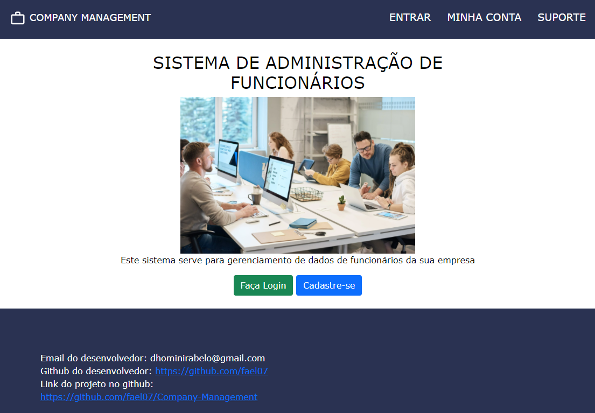
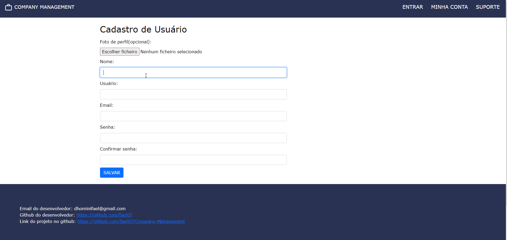
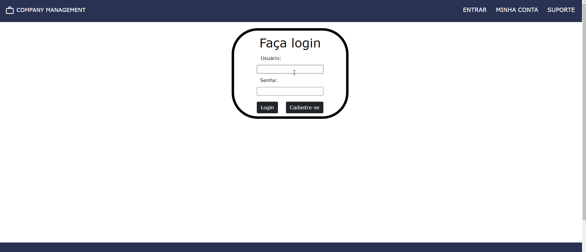

<h1>Company Management</h1>

<a href="#sobre">Sobre</a> • 
<a href="#features">Features</a> • 
<a href="#veja">Veja</a>

<h2 id="sobre">📖 Sobre</h2>

Meu primeiro projeto Django, para colocar em prática o que foi estudado em curso. Este projeto foi desenvolvido para gerenciar os funcionários de uma empresa, você pode criar, editar e filtrar seus funcionários, tendo sua conta como gerente ou presidente. O projeto está hospedado no Heroku, você pode acessar <a href="https://company-management-1.herokuapp.com/" target="_blank">clicando aqui.</a>

 

<h2 id="features">🚀 Features</h2>

<ul>
<li>Django messages</li>
<li>Django session</li>
<li>Django ORM</li>
<li>Django auth</li>
<li>Django files</li>
<li>Django forms com crispy-forms</li>
<li>Paginação</li>
<li>Admin personalizado</li>
</ul>
 

<h2 id="veja">🎥 Veja</h2>

<ul>

<li style="margin-top: 30px;">
<h3>Home</h3>

</li>

<li style="margin-top: 30px;">
<h3>Cadastro</h3>

</li>

<li style="margin-top: 30px;">
<h3>Login</h3>

</li>

</ul>